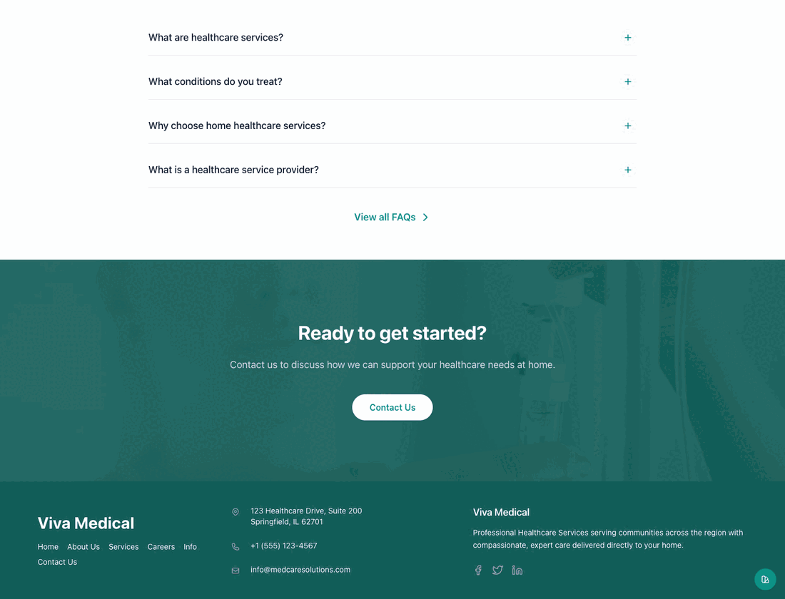

# Healthcare Astro Theme

A free, open-source Astro theme for healthcare and medical service websites. It includes a clean multi-page layout, reusable UI components, Tailwind CSS v4 styling, and a simple structure that is easy to customize for clinics, home care agencies, private practices, and related service businesses.


## Overview

- Built with Astro 7, Tailwind CSS v4, and TypeScript
- Includes 7 ready-to-use pages
- Uses reusable components for heroes, cards, CTAs, icons, and FAQ sections
- Designed to be easy to adapt for real client work or personal portfolio projects
- Fully static by default, so it deploys easily to most hosting platforms

## Best For

- Clinics and private practices
- Home healthcare and care agencies
- Medical service providers
- Developers looking for a clean Astro starter theme
- Portfolio or template marketplace submissions

## Included Pages

- Home
- About
- Services
- Contact
- Careers
- Info / FAQ
- Custom 404 page

## Highlights

- Healthcare-focused visual style
- Responsive layout across mobile and desktop
- SEO-friendly page structure and metadata
- Accessible semantic markup and ARIA usage
- Reusable design tokens and utility classes
- Image optimization through Astro assets
- Smooth client-side navigation with `ClientRouter`
- Straightforward file structure for quick editing

## Tech Stack

- [Astro](https://astro.build/)
- [Tailwind CSS](https://tailwindcss.com/)
- [TypeScript](https://www.typescriptlang.org/)
- [astro-navbar](https://www.npmjs.com/package/astro-navbar)

## Getting Started

### Requirements

- Node.js `22.12.0` or later
- npm, pnpm, or yarn

### Local Development

```bash
git clone https://github.com/web-stacked/healthcare-astro-theme.git
cd healthcare-astro-theme
npm install
npm run dev
```

Open [http://localhost:4321](http://localhost:4321).

### Production Build

```bash
npm run check
npm run build
```

The production output is generated in `dist/`.

## What To Customize First

If you are adapting this theme for a real site, these are the highest-impact changes:

1. Replace the demo brand content in `src/data/navigation.json`
2. Update page text in `src/pages/`
3. Swap the bundled images in `src/assets/`
4. Edit brand and contact details in `src/data/navigation.json`
5. Adjust colors and spacing tokens in `src/styles/tailwind.css`

Theme switcher preview for the token-driven design system:



## Available Scripts

```bash
npm run dev
npm run check
npm run build
npm run preview
```

## Customization

For a full walkthrough, see [CUSTOMIZATION.md](CUSTOMIZATION.md).

Common edits you will likely make first:

1. Update the branding and navigation in `src/data/navigation.json`
2. Replace the images in `src/assets/`
3. Edit the page copy in `src/pages/`
4. Update brand and contact details in `src/data/navigation.json`
5. Adjust colors, spacing, and design tokens in `src/styles/tailwind.css`
6. Replace `public/favicon.svg` and `src/assets/logo.png`

The theme is intentionally simple to edit without needing a CMS, adapter, or backend setup.

The included contact form is a front-end demo. Connect it to your preferred form provider before deploying a production site. You should also confirm that every bundled image is suitable for your intended use or replace the images with your own licensed assets.

## Project Structure

```text
/
├── public/
├── src/
│   ├── assets/
│   ├── components/
│   ├── data/
│   ├── layouts/
│   ├── lib/
│   ├── pages/
│   ├── styles/
│   └── types/
├── astro.config.mjs
├── package.json
├── tsconfig.json
└── CUSTOMIZATION.md
```

## Main Components

- `PageHero.astro`
- `Button.astro`
- `Card.astro`
- `ServiceCard.astro`
- `CallToActionSection.astro`
- `FaqAccordion.astro`
- `Heading.astro`
- `Icon.astro`
- `NumberCounter.astro`

## Deployment

This theme is static by default and can be deployed to platforms such as:

- Netlify
- Vercel
- Cloudflare Pages
- GitHub Pages
- Any static hosting provider

## Submission Notes

This project is currently upgraded to Astro 7 and validated with:

- `npm run check`
- `npm run build`

It is intended to be a lightweight open-source theme rather than a full application starter.

## Contributing

Contributions, fixes, and improvements are welcome. Please see [CONTRIBUTING.md](CONTRIBUTING.md).

## License

This project is licensed under the MIT License. See [LICENSE](LICENSE).

## Author

TechStacked  
[techstacked.dev](https://techstacked.dev)
